# Git - Resumo de Aprendizado

Este repositório foi usado para aprender e praticar os principais comandos e fluxos de trabalho do **Git e GitHub**.

Abaixo está um resumo dos conceitos estudados e comandos utilizados, com exemplos reais testados neste projeto.

---

## ✨ Comandos e Conceitos Aprendidos

### 1. `git init`, `git add`, `git commit`
- Inicialização de repositório local
- Adição e commit de arquivos

```bash
git init
git add .
git commit -m "Primeiro commit"
```
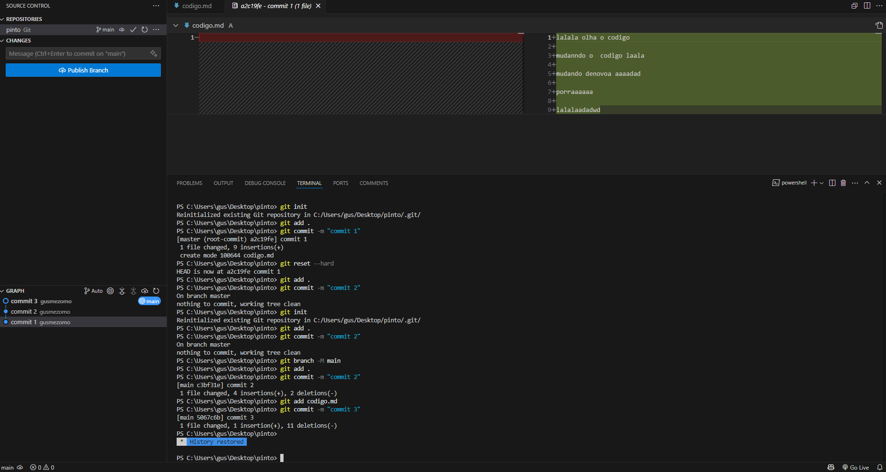

---

### 2. `git checkout`
- Usado para navegar entre commits ou arquivos
- Também pode ser usado para voltar a commits antigos sem afetar o branch principal

```bash
git checkout <hash-do-commit>         # vai para um commit específico (modo detached HEAD)
git checkout nome-da-branch           # muda para outra branch
git checkout -b nova-branch <hash>    # cria uma nova branch a partir de um commit
```
> Muito útil para "observar" estados anteriores sem alterar a linha do tempo
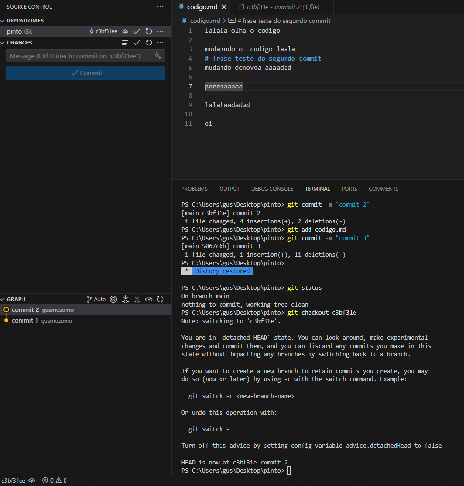

---

### 3. Branches
- Criação e troca de branches

```bash
git branch nome-da-branch      # cria uma branch
git switch nome-da-branch      # troca para a branch
git switch -c nova-branch      # cria e troca
```
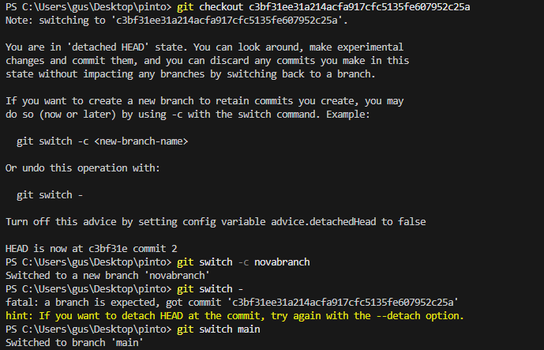
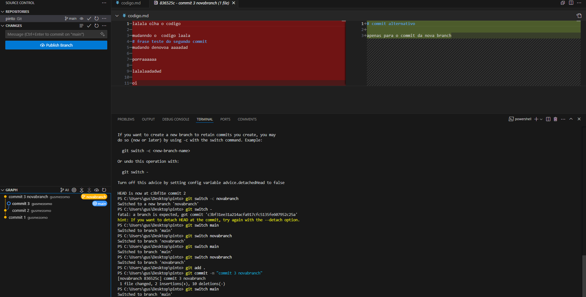
---

### 4. Merge (junção de branches)
```bash
git switch main
git merge nome-da-branch
```
> Inclui resolução de conflitos com VSCode
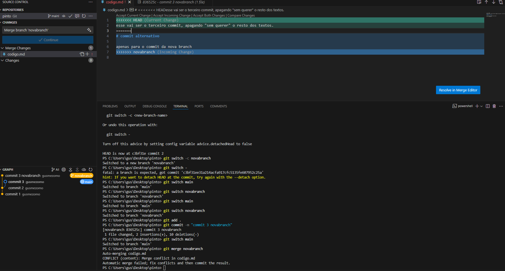
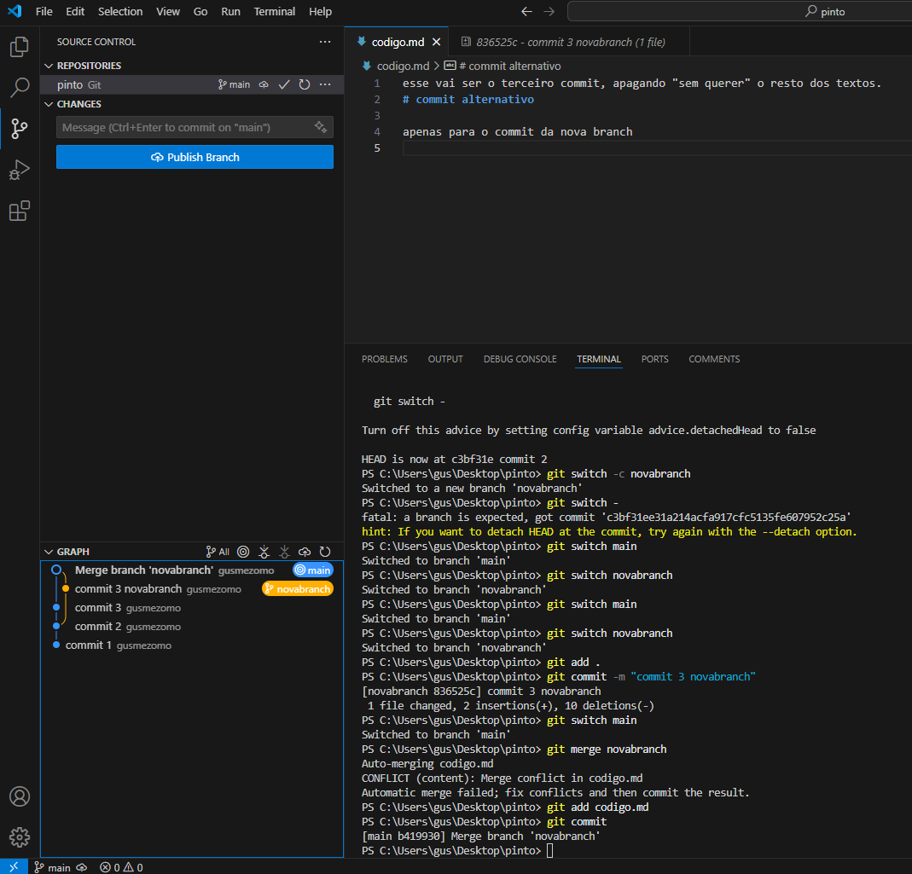

---

### 5. Rebase (reescreve o histórico)
```bash
git switch minha-feature
git rebase main
```
> Usado para manter o histórico linear e limpo
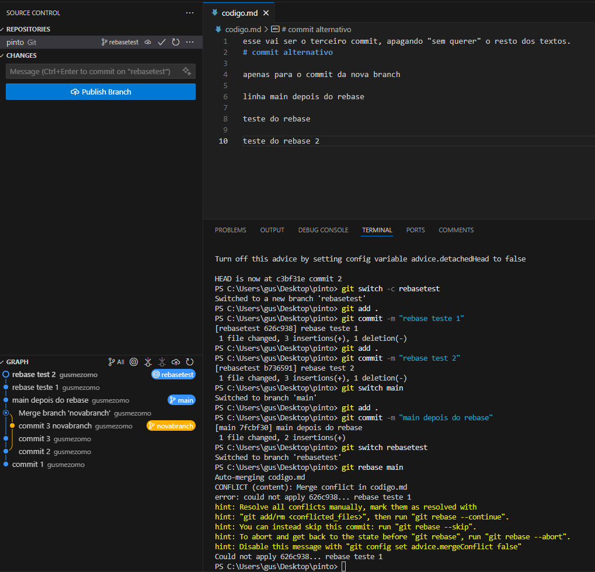
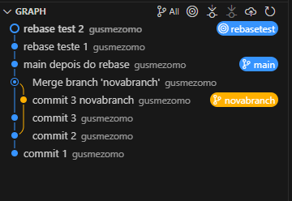

---

### 6. Reset (voltar no tempo)
```bash
git reset --soft HEAD~1      # volta, mas mantém arquivos
git reset --mixed HEAD~1     # volta e tira do staging
git reset --hard HEAD~1      # volta e apaga tudo
```
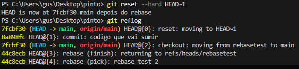

---

### 7. Reflog (histórico secreto do Git)
```bash
git reflog                   # mostra tudo que o HEAD fez
git switch -c recuperado <hash>  # recria branch perdida
```
> Usado para recuperar commits "perdidos"

---

### 8. Restaurar arquivos
```bash
git restore nome.txt              # desfaz mudanças locais
git restore --staged nome.txt    # remove do staging
```

---

### 9. Remover branches
```bash
git branch -d nome     # remove local
git branch -D nome     # remove forçado

git push origin --delete nome  # remove do GitHub
```
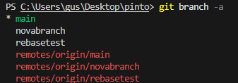
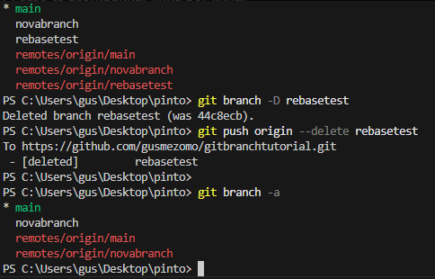

---

### 10. Push para GitHub
```bash
git remote add origin https://github.com/seu-usuario/repositorio.git
git push -u origin main
```
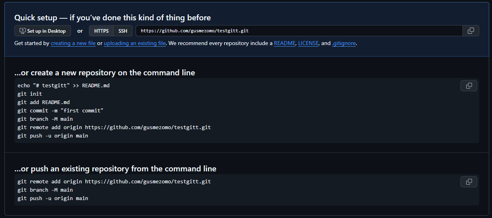

---

### 11. Pull Request
- Criado pelo GitHub com botão "Compare & pull request"
- Revisado, mesclado e branch deletada

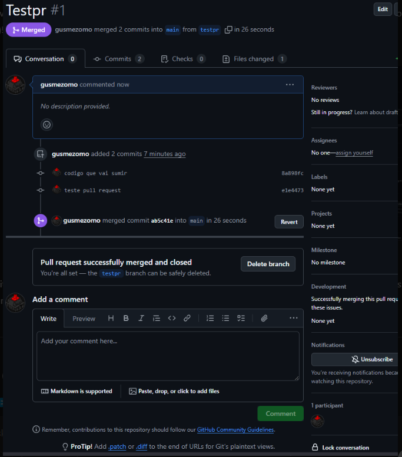

---

## 🌍 Visualização
Este repositório inclui exemplos visuais (prints) do processo completo:
- Criação de commits
- Branches paralelas
- Conflitos e resolução
- Uso do reflog para recuperação
- Merge e rebase
- Fluxo completo de Pull Request

---
Restaurar
```bash
git branch -vv
git clone https://github.com/gusmezomo/gitbranchtutorial.git
cd gitbranchtutorial
git branch -a         # pra ver as branches remotas
git switch novabranch # ou qualquer outra branch remota
```

---

## 🎓 Objetivo
Este repositório foi usado como ambiente de aprendizagem prática do Git e GitHub.
Todos os comandos foram testados e documentados.

---

**Autor:** [gusmezomo](https://github.com/gusmezomo)

